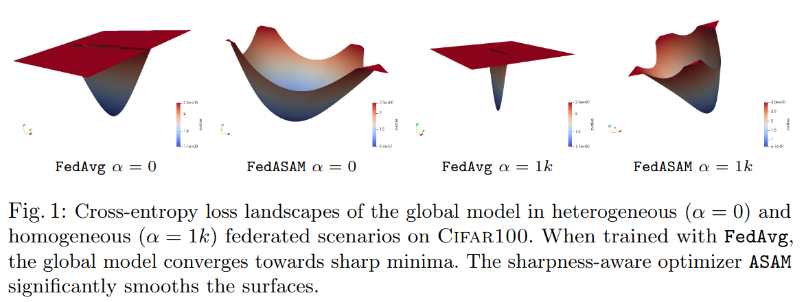

# Improving Generalization in Federated Learning by Seeking Flat Minima

[](https://paperswithcode.com/sota/federated-learning-on-landmarks-user-160k?p=improving-generalization-in-federated)
[](https://paperswithcode.com/sota/federated-learning-on-cifar-100-alpha-0-5?p=improving-generalization-in-federated)
[](https://paperswithcode.com/sota/federated-learning-on-cifar-100-alpha-0-5-5?p=improving-generalization-in-federated)
[](https://paperswithcode.com/sota/federated-learning-on-cityscapes?p=improving-generalization-in-federated)

This repository contains the official implementation of
> Caldarola, D., Caputo, B., & Ciccone, M. [_Improving Generalization in Federated Learning by Seeking Flat Minima_](https://arxiv.org/abs/2203.11834), _European Conference on Computer Vision_ (ECCV) 2022.

[ [Proceedings](https://www.ecva.net/papers/eccv_2022/papers_ECCV/papers/136830636.pdf)] [ [ArXiv](https://arxiv.org/abs/2203.11834) ] [ [Bibtex](#bibtex-citation) ]

## News :loudspeaker:
**\[2025.02\]**  Our follow-up work **FedGloSS** has been accepted at **CVPR 2025**! :tada: 
FedGloSS prioritizes the optimization of _global_ flatness in Federated Learning by using Sharpness-Aware Minimization on the server side, while maintaining communication efficiency.

📄 Read the paper: [ [ArXiv](https://arxiv.org/abs/2412.03752) ] [ [CVF Proceedings](https://openaccess.thecvf.com/content/CVPR2025/html/Caldarola_Beyond_Local_Sharpness_Communication-Efficient_Global_Sharpness-aware_Minimization_for_Federated_Learning_CVPR_2025_paper.html) ] 

💻 Check out the code: [ [GitHub](https://github.com/pietrocagnasso/fedgloss/) ]

**\[2023\]** Discover how **WiMA** (**_Window-based Model Averaging_**) overcomes the limitations of SWA (Stochastic Weight Averaging) in FL - accepted at **ICCV23 Workshops**! :tada:

📄 Read the paper: [ [CVF Proceedings](https://openaccess.thecvf.com/content/ICCV2023W/WiCV/html/Caldarola_Window-Based_Model_Averaging_Improves_Generalization_in_Heterogeneous_Federated_Learning_ICCVW_2023_paper.html) ] 


## Abstract
Models trained in federated settings often suffer from degraded performances and fail at generalizing, especially
when facing heterogeneous scenarios. In this work, we investigate such behavior through the lens of geometry of the loss
and Hessian eigenspectrum, linking the model's lack of generalization capacity to the sharpness of the solution.
Motivated by prior studies connecting the sharpness of the loss surface and the generalization gap, we show that _i)_
training clients locally with Sharpness-Aware Minimization (SAM) or its adaptive version (ASAM) and _ii)_
averaging stochastic weights (SWA) on the server-side can substantially improve generalization in Federated Learning
and help bridging the gap with centralized models.
By seeking parameters in neighborhoods having uniform low loss, the model converges towards flatter minima and its
generalization significantly improves in both homogeneous and heterogeneous scenarios. Empirical results demonstrate the
effectiveness of those optimizers across a variety of benchmark vision datasets (e.g. CIFAR10/100, Landmarks-User-160k,
IDDA) and tasks (large scale classification, semantic segmentation, domain generalization).

<p align="center">
 
</p>


## Setup
### Environment
- Install conda environment (preferred): ```conda env create -f environment.yml```
- Install with pip (alternative): ```pip3 install -r requirements.txt```

### Weights and Biases
The code runs with WANDB. For setting up your profile, we refer you to the [quickstart documentation](https://docs.wandb.ai/quickstart). Insert your WANDB API KEY [here](https://github.com/debcaldarola/fedsam/blob/master/models/main.py#L24). WANDB MODE is set to "online" by default, switch to "offline" if no internet connection is available.

### Resources
All experiments run on one NVIDIA GTX-1070. If needed, you can specify the GPU ID [here](https://github.com/debcaldarola/fedsam/blob/master/models/main.py#L8).

### Data
Execute the following code for setting up the datasets:
```bash
conda activate torch10
cd data
chmod +x setup_datasets.sh
./setup_datasets.sh
```

## Datasets

1. CIFAR-100
  * **Overview**: Image Dataset based on [CIFAR-100](https://www.cs.toronto.edu/~kriz/cifar.html) and [Federated Vision Datasets](https://github.com/google-research/google-research/tree/master/federated_vision_datasets)
  * **Details**: 100 users with 500 images each. Different combinations are possible, following Dirichlet's distribution
  * **Task**: Image Classification over 100 classes

2. CIFAR-10
  * **Overview**: Image Dataset based on [CIFAR10](https://www.cs.toronto.edu/~kriz/cifar.html) and [Federated Vision Datasets](https://github.com/google-research/google-research/tree/master/federated_vision_datasets)
  * **Details**: 100 users with 500 images each. Different combinations are possible, following Dirichlet's distribution
  * **Task**: Image Classification over 10 classes


## Running experiments
Examples of commands for running the paper experiments (FedAvg/FedSAM/FedASAM w/ and w/o SWA) can be found in ```fedsam/paper_experiments```.
E.g. for CIFAR10 use the following command:
```bash
cd paper_experiments
chmod +x cifar10.sh
./cifar10.sh
```

## Bibtex citation
```text
@inproceedings{caldarola2022improving,
  title={Improving generalization in federated learning by seeking flat minima},
  author={Caldarola, Debora and Caputo, Barbara and Ciccone, Marco},
  booktitle={European Conference on Computer Vision},
  pages={654--672},
  year={2022},
  organization={Springer}
}
```
